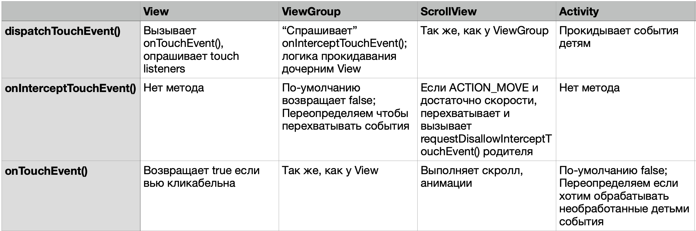

# Touch system

## Motion event

Любое движение репортится через него. Часто используемые поля

- action - тип выполняемого действия
- x, y - координаты относительно вью, что обрабатывает событие
- rawX, rawY - абсолютные координаты на экране
- eventTime - время события на базе SystemClock.uptimeMillis()

## Координаты экрана

Измеряются в пикселях от левого верхнего угла. То есть x = 0; y = 0 - левый верхний угол, x = maxX; y = maxY нижний правый

## Action

Int-константа. Полный список [здесь](https://developer.android.com/reference/android/view/MotionEvent#constants_1). Самые часто используемые

- `ACTION_DOWN` - палец впервые касается экрана. Событие содержит начальную позицию жеста
- `ACTION_UP` - палец убирается с экрана. Содержит конечную позицию жеста
- `ACTION_MOVE` - любые движения между `ACTION_DOWN` и `ACTION_UP` когда конечная позиция отличается от начальной
- `ACTION_CANCEL` - родительская вью перехватывает событие. Например, когда юзер протащил палец по скролл-вью достаточно, чтобы она начала скрол вместо того, чтобы кнопка внутрии нее была нажата

Жест - серсия MotionEvent, начинающаяся с `ACTION_DOWN` и заканчивающаяся либо `ACTION_UP`, либо `ACTION_CANCEL`

## Как Android обрабатывает MotionEvent

Событие "течет" сверху вниз по иерархии вью, от Activity и, если не было перехвачено, до дочерней - где оно произошло

На пути вниз вызывается `dispatchTouchEvent()`. Вью может перехватывать события переопределяя `onInterceptTouchEvent()` - если метод возвращает `true`, значит событие перехвачено и не должно быть передано дочерним вью; если `false` - вью ознакомилось с событием, но пропускает его дальше

Затем когда событие достигает нижнего вью либо если оно было перехвачено, он начинает "течь наверх", вызывая `onTouchEvent()`. Если метод возвращает `true`, событие останавливается здесь. Все необработанные события заканчивают свой путь в `onTouchEvent()` Activity.

Так, у Activity первой вызывается `onInterceptTouchEvent()` и последней `onTouchEvent()`.

Далее разбираем поведение упомянутых функций в `View`, `ViewGroup`, `ScrollView`, `Activity`

## dispatchTouchEvent()

### View.dispatchTouchEvent()

У обычных вью нет "детей", так что реализация метода простая: вызывается `onTouchEvent()` и опрашивает установленных touch listeners, если один из них вернет true - событие обработано

`dispatchTouchEvent()` осуществляет дополнительный менеджмент стейта и сразу вызывает `onTouchEvent()`, поэтому кастомных вью рекомендует переопределять именно `onTouchEvent()`, чтобы не изменить стандартный state management

### ViewGroup.dispatchTouchEvent()

Вызывается `onInterceptTouchEvent()`. Если `false`, то проходится по дочерним вью в порядке обратном порядку их добавления. Если прикосновение в пределах дочерней вью, у нее вызывается `child.dispatchTouchEvent()`. Если `false`, то метод вызывается на следующей дочерней вью

Рекомендуется в `ViewGroup` переопределять `onInterceptTouchEvent()`, т.к. метод для этого и сделан, в то время как `dispatchTouchEvent()` дополнительно менеджит стейт

### ScrollView.dispatchTouchEvent()

Не переопределяет метод, работает аналогично `ViewGroup`

### Activity.dispatchTouchEvent()

Вызывает `dispatchTouchEvent()` на детях. У `Activity` нет `onInterceptTouchEvent()`. Так что переопределяй `dispatchTouchEvent()` если хочешь убедиться, что событие отрабатывает, т.к. если дочернее вью вернет `true` в `onTouchEvent()`, метод `onTouchEvent()` у `Activity` не будет вызван.

## onInterceptTouchEvent()

### View.onInterceptTouchEvent()

Такого метода нет

### ViewGroup.onInterceptTouchEvent()

Всегда возвращает `false` кроме кейса, когда подключена мышь, юзер делает на ней скролл в то время пока `ViewGroup` находится в фокусе.

Основной смысл переопределения - обрабатывать одни типы событий и отдавать дочерним обрабатывать другие, как делает `ScrollView`

### ScrollView.onInterceptTouchEvent()

Переопределяет метод `ViewGroup`. Если `ACTION_MOVE`, проверяет, что у события достаточно скорости в поддерживаемом направлении чтобы оно могло быть считано как перемещение (drag). Если да, возвращает `true` и дочерние вью получают `ACTION_CANCELLED`.

Также вызывает `requestDisallowInterceptTouchEvent()` - означает, что родительские `onInterceptTouchEvent()` должны игнориться и скролл приоритетнее всего, что хотели б делать родители `ScrollView`

### Activity.onInterceptTouchEvent()

Нет метода

## onTouchEvent()

### View.onTouchEvent()

Стандартная реализация возвращает `true` если вью кликабельно, но особо ничего не делает кроме обновления ==нескольких флагов== (ЧТО КАКИХ?)

Дока говорит вызывать `super.onTouchEvent()` при переопределении, т.к. там дополнительный стейт менеджмент, а также рекомендует переопределять `performClick()`, если хотим обрабатывать только клики

### ViewGroup.onTouchEvent()

Так же, как у `View`, не переопределяет метод

### ScrollView.onTouchEvent()

Берет инфу из события чтобы понять насколько нужно проскроллить и выполняет скролл. Анимации, такие как оверскролл, тоже обрабатываются здесь. Также вызывает `requestDisallowInterceptTouchEvent()` ==(ЧТО ЗАЧЕМ СНОВА УЖЕ Ж БЫЛО ВЫЗВАНО?)==

### Activity.onTouchEvent()

Дефолтная реализация всегда выозвращает `false`

## Саммари

[comment]: 

## requestDisallowInterceptTouchEvent()

Из интерфейса `ViewParent` (`ViewGroup` его реализует). Для того, чтобы паренты и паренты парентов не перехыватывали событие.

Паренты должны подчиняться на все время жеста, то есть все инетрцепторы будут выключены с `ACTION_DOWN` и до `ACTION_UP`/`ACTION_CANCELLED`. `requestDisallowInterceptTouchEvent()` нужно вызывать для каждого нового жеста отдельно.
